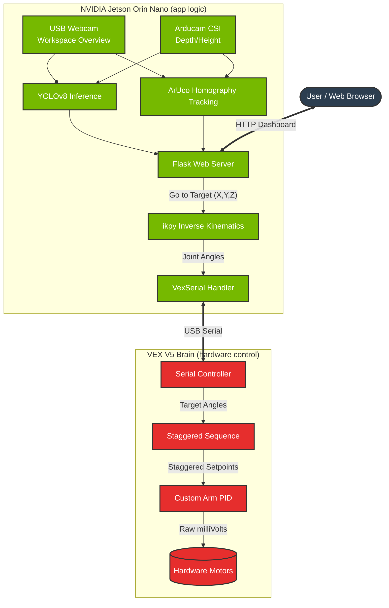

# AI Microgrant: VEX Jetson — Dual-Camera Vision + 5-DOF Robotic Arm

Real-time dual-camera object detection and workspace tracking on **NVIDIA Jetson Orin Nano**, with inverse kinematics control for a **VEX V5 5-DOF robotic arm**. Everything runs in Docker and is served as a web dashboard.

## System Architecture Flowchart



---

## Project Structure

```text
EmbAI_Jetson/
├── Jetson_Code/             ← Jetson Orin Nano Python stack (Vision + IK)
│   ├── stream.py            ← Flask web server (entry point)
│   ├── vision/              ← Camera + YOLO detection package
│   ├── vex/                 ← Robot arm kinematics package
│   ├── Dockerfile           ← Container image definition
│   └── run_docker.sh        ← Launches the container
│
├── VEX_Brain_Code/          ← VEX V5 PROS C++ code
│   ├── src/
│   │   ├── main.cpp         ← Entry point & hardware init
│   │   ├── arm_hardware.cpp ← Motor and sensor interfaces
│   │   └── serial_handler.cpp ← Serial protocol parsers
│   └── project.pros         ← PROS configuration
│
└── README.md                ← This document
```

> **IMPORTANT:** When compiling the robot codebase, you *must* open the `VEX_Brain_Code/` directory as your workspace root (e.g. `cd VEX_Brain_Code && pros mu`), rather than running PROS from this main root.

## Jetson Features

- **Dual-camera streaming** — USB webcam + Arducam IMX519 (CSI) running simultaneously
- **YOLOv8 object detection** — detects and labels objects on both camera feeds
- **ArUco workspace localization** — 4-marker homography maps pixel positions to real-world inches
- **Object height estimation** — ray-plane intersection using ArUco-calibrated depth
- **5-DOF inverse kinematics** — computes joint angles to reach detected objects
- **VEX V5 serial bridge** — sends joint commands over USB serial
- **Web dashboard** — live camera feeds, workspace status, arm control button

## VEX Brain Control Features
- **Custom Voltage PID Loop** — Bypasses internal VEX PIDs to manually supply raw milliVolt control to the robotic arm joints for extreme precision.
- **Bang-Bang High-Power Transits** — Allows rapid movement across massive angles, braking dynamically using a multi-zone threshold.
- **Staggered Command Architecture** — Synchronously buffers asynchronous multiple joint commands to move fluidly in a staggered queue rather than jerking simultaneously.
- **External Rotation Mapping** — Syncs gear ratios to exact turntable and shoulder degrees.

---

## Quick Start

```bash
# 1. Enter the Jetson Python stack folder
cd Jetson_Code

# 2. Build the Docker image (one-time)
sudo bash build_docker.sh

# 3. Run the application
bash run_docker.sh

# 4. Open in browser
# http://<jetson-ip>:5000
```

## System Architecture Details

### Dual-Camera Pipeline

| Camera | Role | Feed | Resolution |
|--------|------|------|------------|
| **USB Webcam** | Workspace overview, ArUco tracking, YOLO detection | `/video_feed` | 640×480 @ 30fps |
| **Arducam IMX519** (CSI) | Forward-facing depth view, height measurement | `/depth_feed` | 640×480 @ 9fps |

The webcam runs in the main Flask process. The Arducam runs as a separate subprocess (`cam0_worker.py`) communicating via IPC files in `/tmp/cam0_stream/`.

### ArUco Workspace Tracking

Uses **4×4_50 dictionary** ArUco markers:

| Marker | Role |
|--------|------|
| **ID 0** | Workspace corner — Top-Left |
| **ID 1** | Workspace corner — Top-Right |
| **ID 2** | Workspace corner — Bottom-Right |
| **ID 3** | Workspace corner — Bottom-Left |

When ≥3 markers are visible, a perspective homography maps any pixel to real-world workspace coordinates in inches. Marker memory persists positions for 2 seconds if temporarily occluded.

### Object Height Estimation

Three methods in priority order:

1. **ArUco ray-plane intersection** — Arducam detects a workspace marker, uses `solvePnP` to define the workspace plane, then intersects the object's pixel ray with that plane for precise distance
2. **Webcam cross-reference** — uses the webcam's ArUco distance measurement shared via IPC
3. **Tilt-based fallback** — geometric estimation from camera height and pitch angle

A `DEPTH_HEIGHT_CALIBRATION` factor (default 0.55) compensates for YOLO bounding box padding.

### 5-DOF Inverse Kinematics

The arm chain is defined in `Jetson_Code/vex/setup.py` and solved by `Jetson_Code/vex/ik_solver.py` using [ikpy](https://github.com/Phylliade/ikpy):

| Joint | Name | Axis | Limits |
|-------|------|------|--------|
| J0 | Turntable | Z (yaw) | 0°–360° |
| J1 | Shoulder | Y (pitch) | 0°–150° |
| J2 | Elbow | Y (pitch) | 0°–180° |
| J3 | Wrist Yaw | Z (yaw) | 0°–180° |
| J4 | Wrist Pitch | Y (pitch) | 0°–180° |

The end-effector is constrained to a **vertical downward orientation** for top-down grasping. The solver seeds from current joint positions (queried via `STATUS` command) for smoother motion planning.

### VEX V5 Serial Protocol

`Jetson_Code/vex/control.py` communicates with `VEX_Brain_Code/src/serial_handler.cpp` over a threaded serial bridge:

```text
PING                          — heartbeat
T <joint 0-4> <degrees>       — move single joint to target degrees
TR <joint 0-4> <radians>      — move single joint to target radians
A <d0> <d1> <d2> <d3> <d4>    — move all 5 joints dynamically (degrees)
AR <r0> <r1> <r2> <r3> <r4>   — move all 5 joints dynamically (radians)
G <degrees>                   — explicit gripper control
HOME                          — send all joints to 0° resting position
STOP                          — emergency freeze all joints immediately
STATUS                        — query current motor positions
                                (V5 replies: POS <d0> <d1> <d2> <d3> <d4>)
```

## Configuration

All tunable parameters are in `Jetson_Code/vision/config.py`:

| Parameter | Default | Description |
|-----------|---------|-------------|
| `YOLO_CLASSES` | `None` | COCO class IDs to detect (`None` = all) |
| `DEPTH_CAMERA_FOV_H_DEG` | `60.0` | Arducam horizontal FOV |
| `DEPTH_FOCUS_DEFAULT` | `268` | IMX519 manual focus value |
| `DEPTH_HEIGHT_CALIBRATION` | `0.55` | YOLO bbox → real height scale factor |
| `MARKER_SIZE_M` | `0.05` | ArUco marker side length (meters) |
| `WORKSPACE_SIDE_M` | `0.61` | Workspace side length (meters) |

Arm kinematics are in `Jetson_Code/vex/setup.py` — update link lengths and joint limits to match your robot.

## Web Dashboard

The dashboard at `http://<jetson-ip>:5000` provides:

- **Workspace Webcam** — live annotated feed with YOLO boxes + ArUco overlay
- **CAM0 Arducam** — depth view with height measurements + manual focus slider
- **Workspace Panel** — real-time marker positions in inches
- **Webcam Objects** — detected objects with 3D workspace coordinates
- **CAM0 Status** — Arducam health, ArUco lock, cup height readings
- **Arm Control** — "Go to Target" button that computes IK and sends joint angles

### API Endpoints

| Endpoint | Method | Description |
|----------|--------|-------------|
| `/` | GET | Web dashboard |
| `/video_feed` | GET | MJPEG webcam stream |
| `/depth_feed` | GET | MJPEG Arducam stream |
| `/aruco_status` | GET | JSON workspace + object status |
| `/set_focus` | POST | Set Arducam focus value |
| `/set_tilt` | POST | Override camera tilt angle |
| `/go_to_target` | POST | Compute IK → send to VEX arm |

## Camera Calibration

Replace approximate FOV-based intrinsics with real calibration:

```bash
cd Jetson_Code

# Capture checkerboard images
python3 -m vision.calibrate_camera capture --output-dir calibration_images

# Solve calibration (9×6 checkerboard, 25mm squares)
python3 -m vision.calibrate_camera solve \
  --image-dir calibration_images \
  --cols 9 --rows 6 --square-size 25.0
```

Writes `vision/camera_calibration.json`, loaded automatically on next start.

## Kinematic Calibration & Tuning

To map the theoretical IK joints to the physical VEX arm accurately, several specific tuning parameters are applied:

- **Workspace Frame Rotation**: The overhead camera maps pixel coordinates to physical space, but the arm faces sideways toward the center of the board. The transformation is mathematically mapped in `stream.py`: `IK_X = -Workspace_Y` and `IK_Y = -Workspace_X`.
- **Base Eccentricity Tracker**: ArUco Marker #4 acts as the base tracking coordinate, but is taped physically 2.1 inches left of the True turntable axis. The `ARUCO_TO_BASE_XYZ` parameter in `vex/setup.py` compensates for this by internally overriding the base Y-coordinate to `0.0`.
- **Sweep Prevention (Wrist Bounds)**: An unbounded IK solver will randomly attempt to reach straight points by whipping the Turntable vastly to the right, and compensating by twisting the Wrist Yaw (J3) back to the left, causing erratic snake-like sweeps. To guarantee a human-like point-and-extend trajectory, J3 bounds (`wrist_yaw` in `setup.py`) are strictly restricted to `[-5, 5]` degrees.
- **Grabbing Depth Offset**: The Arducam IMX519 height detection measures the top rim of objects (like cups). The targeting logic in `stream.py` automatically cascades a `Z_REACH_OFFSET_IN = 2.0` depth-offset constraint so the fingertips plunge 2 inches beneath the optical plane to securely grip the core object diameter.
- **Base Drift Mitigation**: If the Turntable's actual zero-point drifts off-square due to table vibration, `TURNTABLE_YAW_OFFSET_DEG` inside `stream.py` provides a constant lateral sweep adjustment immediately before serial base rotation command dispatch.

## Hardware

| Component | Details |
|-----------|---------|
| **Compute** | NVIDIA Jetson Orin Nano (JetPack 6.1 / L4T 36.x) |
| **Workspace Camera** | USB webcam (V4L2), 120° FOV |
| **Depth Camera** | Arducam IMX519 (CSI), 60° FOV, autofocus via I2C |
| **Robot** | VEX V5 Brain via USB serial |
| **Arm** | 5-DOF: turntable + shoulder + elbow + wrist yaw + wrist pitch |

## Docker

Based on `nvcr.io/nvidia/l4t-ml:r36.2.0-py3` with:
- PyTorch 2.1.0 (CUDA-compiled, native)
- OpenCV 4.8.1 (CUDA-compiled, native)
- Ultralytics (installed `--no-deps` to preserve native libs)
- ikpy, pyserial, Flask

## Troubleshooting

| Issue | Fix |
|-------|-----|
| Port 5000 in use | `sudo docker kill $(sudo docker ps -q)` |
| "corrupted size vs. prev_size" | Ensure `import torch` before `import cv2` |
| Camera not found | `v4l2-ctl --list-devices`, update `CAMERA_DEVICE` in config |
| Arducam not streaming | Check for Python errors — usually a missing variable init |
| Serial permission denied | `sudo chmod a+rw /dev/ttyACM0` |
| IK "no axis" error | Ensure all chain links have `rotation=[x,y,z]` (not `None`) |
